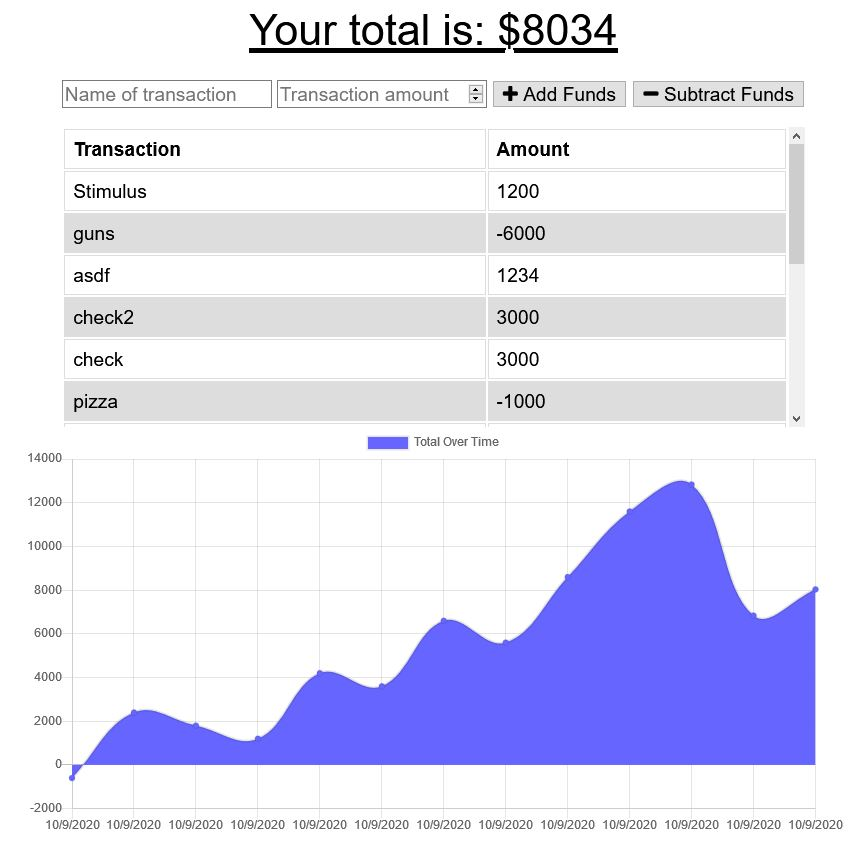

# Budget Tracker

## Description

* Budget Tracker allows users to input debits and credits thus allowing users to keep track of expenses and current balance.

## Usage

* Simply clone the repository; npm install from the command line.  Necessary modules are listed in the package.json.

## Credits:

* Node Express
* MongoDB
* Mongoose
* Morgan
* Compression

## Questions:
  
For additional information visit my GitHub page:
* [GitHub Profile](https://github.com/bg00924)

For questions please send me an email at:
* bg00924@gmail.com

## Preview

